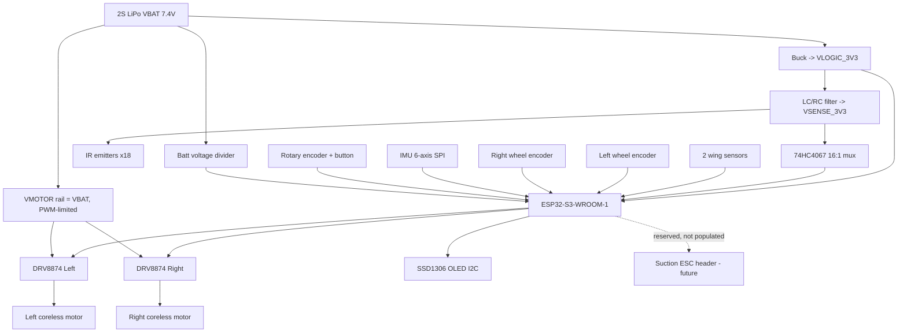

# System Block Diagram & Rail Map

Canonical big-picture reference. All other `docs/hardware/` files use the subsystem
and rail names defined here (`VBAT`, `VLOGIC_3V3`, `VSENSE_3V3`, `VMOTOR`).

## Fast-default chassis (working baseline, revisable)

- PCB-as-chassis: **~90 mm W × ~100 mm L**, low profile, **short wheelbase** for agility.
- Wheel track (L↔R contact) **~85 mm**; wheel ⌀ **~32 mm** silicone tire.
- CG **low + centered over the drive axle**; low-friction **front skid/ball** as 3rd contact.
- Battery: **2S LiPo, ~450 mAh** light pack (runtime traded for low mass).
- Sensor nose on front edge (own PCB, ribbon-linked so geometry is tunable).

## Block diagram

## Rail table

| Rail | Source | Nominal V | Consumers |
|------|--------|-----------|-----------|
| `VBAT` | 2S LiPo | 7.4 V (6.0–8.4) | Buck input, `VMOTOR`, batt divider |
| `VMOTOR` | = `VBAT` (PWM-limited at driver) | 7.4 V | DRV8874 ×2 → motors; bulk cap |
| `VLOGIC_3V3` | Buck from `VBAT` | 3.3 V | ESP32-S3, IMU, OLED, rotary, driver logic |
| `VSENSE_3V3` | LC/RC-filtered from buck | 3.3 V | 74HC4067 mux, IR emitters, phototransistor bias |

## Noise discipline (the "random errors" defense)

Motor switching noise on the analog sensor read is the #1 cause of erratic behavior
in fast LFRs. Therefore, at layout time:

- **`VMOTOR` / motor traces physically separated** from `VSENSE_3V3` and all analog
  sensor traces; no analog trace runs under or beside a motor/PWM trace.
- **Star ground**: motor-return and logic/analog-return meet only at one point near
  the battery.
- **Decoupling** on every IC; **bulk low-ESR cap** across `VMOTOR`; flyback/RC snubbing
  at each driver.
- **Brownout detector enabled** in firmware; **watchdog** kicks each control loop.

## Subsystem coverage (feeds the other four docs)

Sensors (line array + wings), motors + drivers, encoders, IMU, UI (OLED + rotary),
power (4 rails), and the reserved suction path each appear above and are specified in
`BOM.csv`, `PINMAP.md`, and `POWER-BUDGET.md`.
