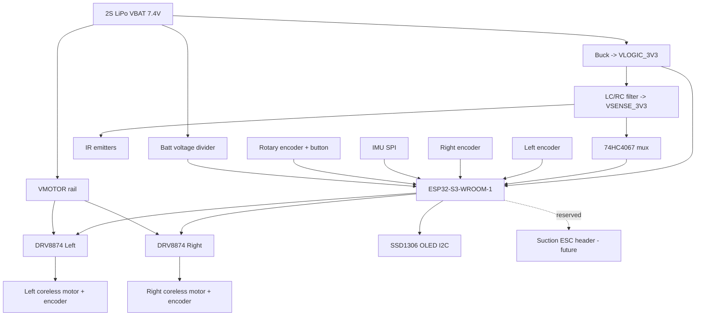

# Phase 0 — Architecture & BOM Lock — Implementation Plan

> **For agentic workers:** REQUIRED SUB-SKILL: Use superpowers:subagent-driven-development (recommended) or superpowers:executing-plans to implement this plan task-by-task. Steps use checkbox (`- [ ]`) syntax for tracking.

**Goal:** Lock every hardware decision — exact part numbers, full pin map, and a verified power budget — into committed reference docs so Phase 1 (schematic + PCB) can start with zero open questions.

**Architecture:** ESP32-S3 brain; 16 analog reflectance sensors via 74HC4067 mux → fast ADC; 2 wing sensors; 2 wheel encoders + 1 IMU (fusion foundation for track-mapping); coreless motors on per-motor DRV8874-class drivers; 2S LiPo with separated motor/logic/analog rails; OLED + rotary-encoder UI; JLCPCB SMT assembly.

**Tech Stack:** Deliverables are Markdown + CSV docs (BOM, pin map, power budget, block diagram). No firmware/PCB yet. Verification = live JLCPCB/vendor stock checks + arithmetic budget checks.

## Global Constraints

- **MCU:** ESP32-S3-WROOM-1 module (verbatim from spec §3). HAL-isolated so a Teensy 4.1 port touches only the HAL later.
- **Assembly:** JLCPCB SMT-assembled; prefer **JLC "Basic" or in-stock "Extended"** parts to cut cost/risk. Every SMD part must resolve to an LCSC part number with live stock.
- **Budget ceiling:** ~$400 / ₹35k for one robot incl. PCB fab + spares.
- **Sensors:** 16 analog reflectance (line) + 2 wing, analog (interpolated), read via 74HC4067 mux.
- **Odometry/attitude designed in from day 1:** 2 wheel encoders + 1 IMU — even though track-mapping (mode C) firmware comes later.
- **Power rails:** motor (LiPo direct, PWM-limited), logic 3.3 V (buck), analog (separately filtered). Star ground, brownout enabled.
- **Fail-safe posture:** no design choice may allow motor runaway on line loss; watchdog + brownout are non-negotiable.
- **Suction:** provision only (ESC header + power path); not counted in v1 mass/current budget beyond a reserved header.
- **Every deliverable is committed** to `docs/hardware/` and pushed.

---

## File Structure

All Phase 0 outputs live under `docs/hardware/`:

- `docs/hardware/BLOCK-DIAGRAM.md` — system block diagram (mermaid) + rail map. One responsibility: the big picture every other doc references.
- `docs/hardware/BOM.csv` — one row per part: ref-des class, function, chosen MPN, LCSC/JLC part #, package, qty, unit cost, in-stock?, alt MPN. Single source of truth for parts.
- `docs/hardware/PINMAP.md` — every ESP32-S3 GPIO assigned, with peripheral, direction, and notes (strapping-pin/ADC-capable conflicts flagged). Single source of truth for pins.
- `docs/hardware/POWER-BUDGET.md` — rail-by-rail current/voltage math, worst-case draw, battery-life estimate, regulator headroom. Single source of truth for power.
- `docs/hardware/DECISIONS.md` — short ADR log: each locked choice + one-line rationale + rejected alternative.

These five files fully specify Phase 1's inputs.

---

## Task 1: System block diagram + rail map

**Files:**
- Create: `docs/hardware/BLOCK-DIAGRAM.md`

**Interfaces:**
- Produces: the canonical subsystem list + rail names (`VBAT`, `VLOGIC_3V3`, `VSENSE_3V3`, `VMOTOR`) that BOM, PINMAP, and POWER-BUDGET all reference.

- [ ] **Step 1: Write the block diagram doc**

Create `docs/hardware/BLOCK-DIAGRAM.md` containing a mermaid block diagram with these nodes and power/signal edges:



Below the diagram, add a **rail table**: rail name | source | nominal V | who consumes it. Add a one-paragraph note that motor traces and `VSENSE_3V3`/analog traces must be physically separated (noise → the "random errors" risk).

- [ ] **Step 2: Verify — self-consistency check**

Confirm every rail named in the table appears in the diagram and vice-versa; confirm all five downstream docs' subsystems (sensors, motors, encoders, IMU, UI, power, suction-reserved) each appear as a node. Fix mismatches.

- [ ] **Step 3: Commit**

```bash
git add docs/hardware/BLOCK-DIAGRAM.md
git commit -m "docs(hw): add system block diagram and power rail map"
```

---

## Task 2: ESP32-S3 pin map

**Files:**
- Create: `docs/hardware/PINMAP.md`

**Interfaces:**
- Consumes: subsystem list from `BLOCK-DIAGRAM.md`.
- Produces: named GPIO assignments (e.g. `MUX_S0..S3`, `MUX_ADC` (ADC1 channel), `EMIT_EN`, `AIN1/AIN2/PWMA`, `BIN1/BIN2/PWMB`, `ENCL_A/B`, `ENCR_A/B`, `IMU_SCLK/MOSI/MISO/CS`, `I2C_SDA/SCL`, `ROT_A/B/SW`, `VBAT_SENSE`) consumed by Phase 1 schematic and all firmware phases.

- [ ] **Step 1: Draft the pin map table**

Create `docs/hardware/PINMAP.md` with a table: signal name | GPIO | peripheral | dir | notes. Assign against these hard ESP32-S3 rules (write them at top of file as the checklist):
- **Mux analog output MUST land on an ADC1 GPIO** (GPIO1–GPIO10). ADC2 is unusable when WiFi is on — wireless tuning needs WiFi, so **ban ADC2 for the sensor read**.
- **Battery voltage divider MUST also be ADC1.**
- Avoid strapping pins GPIO0, GPIO45, GPIO46 for anything that must be a specific level at boot; if used, note the constraint.
- Reserve GPIO19/GPIO20 (native USB D-/D+) for USB — do not reuse.
- 4 mux select lines (S0–S3), 1 emitter-enable, 6 motor (2×[IN1,IN2,PWM]), 4 encoder (2×[A,B]), 4 IMU SPI, 2 I2C, 3 rotary (A,B,SW), 1 batt-sense, 1 reserved ESC PWM = **26 signals**; confirm they fit WROOM-1's available GPIO.

- [ ] **Step 2: Verify — pin-fit + conflict check**

Cross-check each assignment: (a) no GPIO used twice; (b) sensor mux ADC + batt-sense are both ADC1; (c) strapping/USB pins respected; (d) total signal count ≤ available module GPIO. List any conflict and reassign until clean. Record the final "GPIO used / free" count at the bottom.

- [ ] **Step 3: Commit**

```bash
git add docs/hardware/PINMAP.md
git commit -m "docs(hw): lock ESP32-S3 pin map (ADC1-only sensor read, no ADC2)"
```

---

## Task 3: Line + wing sensor selection

**Files:**
- Create: `docs/hardware/BOM.csv` (start it here)
- Modify: `docs/hardware/DECISIONS.md` (create + first entry)

**Interfaces:**
- Consumes: sensor count + mux topology from constraints.
- Produces: BOM rows `SENSOR_REFLECT`, `SENSOR_EMITTER`, `MUX`, and the analog front-end (bias resistors) referenced by POWER-BUDGET (emitter current) and Phase 1.

- [ ] **Step 1: Choose sensor + mux, record BOM rows**

Create `docs/hardware/BOM.csv` with header:
`class,function,MPN,LCSC,package,qty,unit_usd,in_stock,alt_MPN,notes`

Add rows for the line front-end. Recommended baseline (adjust after stock check):
- Reflective sensor: phototransistor + IR emitter pair. Prefer an integrated reflective sensor with analog output — candidate **QRE1113 (analog)** or discrete **SFH309 phototransistor + IR LED**. 18 units (16 line + 2 wing).
- Analog mux: **74HC4067** (16:1) — single package covers all 16 line channels; wings read on 2 spare ADC1 GPIOs directly (faster, no mux settle).
- Emitter drive: series resistors sized in Task 6; add placeholder row `R_EMIT`.

- [ ] **Step 2: Verify — live JLC/LCSC stock check**

For each SMD row, look up the MPN on LCSC/JLCPCB and fill `LCSC` + `in_stock`. If a first choice is out of stock or "Extended with fee," switch to the in-stock alternate and update `MPN`/`alt_MPN`. **A row is not done until `in_stock` = yes and `LCSC` is a real part number.**

- [ ] **Step 3: Record decision**

Create `docs/hardware/DECISIONS.md`, add an entry: chosen sensor family + mux, one-line why (analog interpolation, single-mux simplicity), and the rejected alternative (e.g. digital QTR modules — rejected: no sub-sensor interpolation).

- [ ] **Step 4: Commit**

```bash
git add docs/hardware/BOM.csv docs/hardware/DECISIONS.md
git commit -m "docs(hw): select analog reflectance array + 74HC4067 mux"
```

---

## Task 4: Motors, drivers, encoders, wheels

**Files:**
- Modify: `docs/hardware/BOM.csv`, `docs/hardware/DECISIONS.md`

**Interfaces:**
- Consumes: motor pins from PINMAP (`AIN1/2,PWMA,BIN1/2,PWMB,ENCL_A/B,ENCR_A/B`).
- Produces: BOM rows `MOTOR`, `DRIVER`, `ENCODER`, `WHEEL`, `TIRE`; motor stall/continuous current feeds POWER-BUDGET.

- [ ] **Step 1: Choose drivetrain parts, add BOM rows**

Add rows:
- Driver: **DRV8874** (one per motor, ~2.1 A cont., 6.5–45 V, PWM + IN/IN modes, current sense) — qty 2. Alt: DRV8871 (no current sense) if 8874 out of stock.
- Motors: high-RPM small **coreless brushed** (e.g. N20-frame coreless or 716/816-class) chosen for high output RPM at 7.4 V; qty 2. Record rated V, no-load RPM, stall current.
- Encoders: magnetic — **AS5600** (I2C absolute) is easy but I2C-slow for 2 units; prefer **quadrature magnetic encoder** (Hall, A/B) matched to motor shaft, qty 2. Record CPR.
- Wheels + silicone tires sized for the chassis; qty 2 (+ spares).

- [ ] **Step 2: Verify — stock + interface fit**

Stock-check each SMD part (DRV8874) on LCSC. Confirm encoder output type matches PINMAP (quadrature A/B → 4 GPIO). Confirm driver logic is 3.3 V-compatible. Confirm motor rated voltage ≤ 2S nominal headroom. Fix mismatches.

- [ ] **Step 3: Record decisions**

Append to `DECISIONS.md`: driver choice (per-motor for current headroom + fast switching; rejected TB6612 — marginal current), encoder choice (quadrature vs AS5600 I2C-bandwidth tradeoff), motor choice (coreless for RPM).

- [ ] **Step 4: Commit**

```bash
git add docs/hardware/BOM.csv docs/hardware/DECISIONS.md
git commit -m "docs(hw): select coreless motors, DRV8874 drivers, quad encoders"
```

---

## Task 5: IMU, UI, power components

**Files:**
- Modify: `docs/hardware/BOM.csv`, `docs/hardware/DECISIONS.md`

**Interfaces:**
- Consumes: IMU SPI pins, I2C pins, rotary pins, batt-sense pin from PINMAP.
- Produces: BOM rows `IMU`, `OLED`, `ROT_ENC`, `BUCK`, `LIPO`, `CONN_*`, `CAP_BULK`, decoupling, `ESC_HEADER` (reserved).

- [ ] **Step 1: Add remaining BOM rows**

- IMU: **ICM-42688-P** (6-axis, SPI, low noise) — alt MPU-6500. qty 1.
- Display: **SSD1306 128×64 OLED, I2C**. qty 1.
- Input: **rotary encoder + push** (EC11-class), qty 1.
- Buck: **TPS563201** or **MP1584** → 3.3 V, size for logic+sensor rail current (from Task 6). qty 1.
- Battery: **2S LiPo** + XT30 connector + balance; qty 1.
- Bulk cap across VMOTOR (e.g. 470–1000 µF low-ESR) + per-IC 0.1 µF decoupling; flyback/RC per driver.
- Reserved: `ESC_HEADER` (3-pin) + power tap for future suction fan — placed, not populated.

- [ ] **Step 2: Verify — stock + rail compatibility**

Stock-check IMU, buck, OLED, rotary, connectors on LCSC. Confirm IMU is SPI (not just I2C) to match PINMAP SPI assignment; if only I2C variant in stock, note the PINMAP change needed and update PINMAP.md. Confirm buck input range covers 2S (6.0–8.4 V) and output ≥ required 3.3 V current with margin.

- [ ] **Step 3: Record decisions + commit**

Append IMU/buck rationale to `DECISIONS.md`.

```bash
git add docs/hardware/BOM.csv docs/hardware/PINMAP.md docs/hardware/DECISIONS.md
git commit -m "docs(hw): select IMU, OLED UI, buck, connectors, reserve ESC header"
```

---

## Task 6: Power budget + emitter/driver sizing

**Files:**
- Create: `docs/hardware/POWER-BUDGET.md`
- Modify: `docs/hardware/BOM.csv` (fill `R_EMIT`, buck rating, bulk cap value)

**Interfaces:**
- Consumes: current figures from every BOM row (motor stall/cont, emitter count, MCU, OLED, IMU).
- Produces: locked buck current rating, emitter resistor value, bulk cap value, battery-life estimate — final numbers Phase 1 needs.

- [ ] **Step 1: Compute the budget**

Create `docs/hardware/POWER-BUDGET.md` with a per-rail table and worst-case math:
- **VLOGIC_3V3:** ESP32-S3 (WiFi active peak ~ hundreds of mA) + IMU + OLED + logic → sum, ×1.5 margin → **required buck current**. Update buck row if under-rated.
- **VSENSE_3V3:** IR emitter current. Pick emitter forward current (e.g. 10–20 mA each), compute `R_EMIT = (3.3 − Vf)/I`, ×18 emitters for total; note whether emitters are always-on or strobed (strobing cuts average draw — recommend strobe/enable line).
- **VMOTOR:** 2× coreless continuous + brief stall; size bulk cap for stall transients; confirm LiPo C-rating supplies peak.
- **Battery life:** pack mAh ÷ average total current → runtime estimate; flag if < a practical run length.

- [ ] **Step 2: Verify — arithmetic + headroom check**

Re-add each rail total; confirm buck rating ≥ 1.5× VLOGIC+VSENSE draw; confirm LiPo peak (mAh × C) ≥ motor stall + logic peak; confirm no rail exceeds a component's rating. Any failure → change the part in BOM.csv and re-run the math. Record final locked values.

- [ ] **Step 3: Commit**

```bash
git add docs/hardware/POWER-BUDGET.md docs/hardware/BOM.csv
git commit -m "docs(hw): power budget, emitter resistor + buck sizing, batt-life estimate"
```

---

## Task 7: BOM cost roll-up + Phase 0 gate

**Files:**
- Modify: `docs/hardware/BOM.csv`, `docs/hardware/DECISIONS.md`

**Interfaces:**
- Consumes: all BOM rows.
- Produces: total cost vs budget verdict; the "Phase 0 complete" marker Phase 1 depends on.

- [ ] **Step 1: Roll up cost**

Add a total row / summary block to `BOM.csv` (or a short `## Cost` section in `DECISIONS.md`): sum `unit_usd × qty` for one robot, add PCB fab+assembly estimate + 20% spares. Compare to the $400 ceiling.

- [ ] **Step 2: Verify — Phase 0 completeness gate**

Confirm all of: every BOM SMD row has a real in-stock LCSC part; PINMAP has zero conflicts and sensor read is ADC1-only; POWER-BUDGET rails all pass headroom; total cost ≤ budget. Write a `## Phase 0 Gate` checklist in `DECISIONS.md` with each item checked. If any item fails, it is a Phase 0 blocker — fix before proceeding.

- [ ] **Step 3: Commit + push**

```bash
git add docs/hardware/
git commit -m "docs(hw): BOM cost roll-up + Phase 0 completeness gate passed"
git push
```

---

## Self-Review (completed by plan author)

- **Spec coverage:** MCU (Task 2,5), 16+2 sensors/mux (Task 3), motors/drivers/encoders (Task 4), IMU (Task 5), power rails + noise discipline (Task 1,6), UI (Task 5), suction provision (Task 5 reserved header), budget (Task 7), fail-safe posture (encoded as constraints; enforced in firmware phases). Chassis/PCB layout → Phase 1 plan (out of scope here, by design). Track-mapping (C) → later firmware plan. All Phase-0-relevant spec items covered.
- **Placeholder scan:** part numbers are named candidates with an explicit live-stock verification step (not fabricated stock numbers) — this is correct for hardware sourcing, not a placeholder failure.
- **Type consistency:** rail names (`VBAT/VLOGIC_3V3/VSENSE_3V3/VMOTOR`) and signal names introduced in Tasks 1–2 are reused verbatim in Tasks 3–6.

---

## Next plans (not written yet — each when it's next)

- **Phase 1:** schematic + main PCB + sensor PCB (EDA), DRC, JLC assembly export.
- **Phase 2:** firmware skeleton + HAL + native unit tests (this is where TDD/pytest-style plans fully apply — control math is unit-testable off-hardware).
- **Phases 3–6:** bring-up, reactive follow (B), adaptive speed + wings, robustness soak.
- **Phase 7:** track-mapping mode (C). **Phase 8:** suction module.
